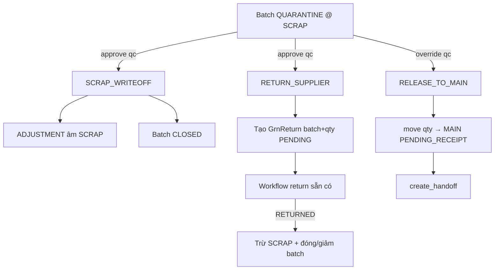

# QC Expansion — 01. FSD Wave 1: Quarantine Disposition

> Trạng thái: **Implemented — Wave 1** (2026-08-04)
> Nguồn: [`qc_plan.md`](../../qc_plan.md) §0 / §P0 (đã thống nhất phản biện Claude 2026-08-04)
> Phạm vi: đóng vòng lô `QUARANTINE` tại Kho phế (SCRAP) — 3 disposition.
> **Ngoài phạm vi Wave 1:** `REWORK`, criteria gate, skip-lot / `qc_required`, KPI analytics, email NCC.

## 0. Tóm tắt vấn đề

Hiện tại QC FAIL / PARTIAL fail đưa hàng vào Batch `QUARANTINE` @ SCRAP + alert stale >7 ngày
(`stale_quarantine_batches`), nhưng **không có thao tác đóng vòng**. BACKLOG mục 2c dòng disposition
còn `[ ]`. `GrnReturn` chỉ sinh từ `qc_fail` (FULL), không gắn batch/qty; `qc_partial_pass` không tạo
return; `mark_return_returned` chỉ đổi status phiếu, **không** trừ Inventory SCRAP.

## 1. Actor và quyền (PA1 — đã chốt)

Không thêm permission mới. Tái dùng RBAC module `qc`:

| Disposition | Gate view + service | Ai được |
|---|---|---|
| `SCRAP_WRITEOFF` | `user.can('approve', 'qc')` **và** `can_view_menu('inventory')` | QC Inspector, Manager, Admin |
| `RETURN_SUPPLIER` | `user.can('approve', 'qc')` **và** `can_view_menu('inventory')` | Như trên |
| `RELEASE_TO_MAIN` | `user.can('override', 'qc')` **và** `can_view_menu('inventory')` | Chỉ Manager / Admin (role) |

Service **re-validate** quyền (không tin view). Không dùng `is_department_manager`, không Approval 2 bước,
không `can_dispose_quarantine()`.

## 2. Model delta

### 2.1 `receiving.GrnReturn`

| Field | Kiểu | Ghi chú |
|---|---|---|
| `batch` | FK → `inventory.Batch`, `null=True`, `blank=True`, `PROTECT`, `related_name='returns'` | Null = legacy FULL-fail (1 return / GRN, bao phủ mọi lô SCRAP của GRN). Non-null = return gắn đúng 1 lô QUARANTINE (disposition / PARTIAL). |
| `qty` | `PositiveIntegerField`, `null=True`, `blank=True` | Null khi `batch` null. Khi `batch` set: `1 ≤ qty ≤ batch.qty_available` tại thời điểm tạo. |

Sửa docstring model: **bỏ** câu “KHÔNG đụng Inventory” — FAIL đã credit SCRAP; disposition/return
sẽ trừ SCRAP khi writeoff hoặc khi `RETURNED`.

### 2.2 `qc_fail` (chỉnh nhẹ)

Giữ 1 `GrnReturn` / GRN khi FULL fail (`batch=null`, `qty=null`) — không đổi cardinality. Inventory
SCRAP được trừ khi phiếu → `RETURNED` (xem §3.2), không lúc tạo return.

### 2.3 Không model Disposition riêng

Ba action là service functions + audit; không tạo bảng `QuarantineDisposition`.

## 3. Luồng nghiệp vụ

### 3.1 `scrap_writeoff(batch, *, qty, reason, actor, ...)`

**Điều kiện:**
- `batch.status == QUARANTINE`
- `batch.location.warehouse.warehouse_type == SCRAP`
- `1 ≤ qty ≤ batch.qty_available`
- Không có `GrnReturn` mở (`PENDING`/`APPROVED`) gắn `batch=this` **hoặc** (legacy) `batch is null` cùng `grn` của batch
- Actor có `approve` trên `qc`

**Hiệu ứng (atomic):**
1. Lock Inventory SCRAP → Batch (đúng standing order)
2. `qty_used += qty`; nếu `qty_available==0` → `status=CLOSED`, else **giữ** `QUARANTINE` (không promote `PARTIAL_USED`)
3. `Inventory.qty_on_hand -= qty` + `record_movement(ADJUSTMENT, qty=-qty, reference=batch_code)`
4. `log_action(..., reason=reason)` — `reason` vào kwargs `reason=`, description ngắn (không nhét lý do dài vào `description`)

### 3.2 `return_quarantine_to_supplier(batch, *, qty, reason, actor, ...)`

**Điều kiện:** như writeoff về status/warehouse/qty/open-return; actor `approve` trên `qc`.
- `batch.grn_item` phải non-null (cần GRN để tạo return)

**Hiệu ứng lúc tạo:**
1. `GrnReturn.objects.create(grn=batch.grn_item.grn, batch=batch, qty=qty, reason=reason, status=PENDING)`
2. Audit + notify theo convention return hiện có (nếu có)
3. **Chưa** trừ Inventory

**Hiệu ứng khi `mark_return_returned` (mở rộng):**
- Nếu `grn_return.batch` set: trừ đúng `grn_return.qty` khỏi batch đó (cùng rule status như writeoff) + ADJUSTMENT SCRAP
- Nếu `grn_return.batch` null (FULL fail legacy): với mọi Batch `QUARANTINE` còn `qty_available>0` có `grn_item__grn=grn_return.grn`, trừ hết `qty_available` từng batch (order by `product_id`, `pk`), ADJUSTMENT từng dòng

`close_return` không đụng inventory thêm (đã trừ ở `RETURNED`).

### 3.3 `release_quarantine_to_main(batch, *, qty, location, reason, actor, assigned_to=None, ...)`

**Điều kiện:**
- Batch QUARANTINE @ SCRAP, qty hợp lệ, không open return che batch (như trên)
- `location.warehouse_type == MAIN`, warehouse + location active
- Actor có `override` trên `qc`
- `reason` bắt buộc (non-blank)

**Hiệu ứng:**
1. Tách/chuyển `qty` từ batch QUARANTINE → batch mới `PENDING_RECEIPT` tại `location` (cùng lineage `grn_item`, mfg/exp/supplier)
2. Inventory SCRAP ↓ / MAIN ↑ qua TRANSFER_OUT/IN (hoặc helper nội bộ tương đương `move_batch_qty` nhưng **cho phép nguồn QUARANTINE**; partial nguồn giữ `QUARANTINE`, full → `CLOSED`)
3. `create_handoff(...)` trên batch mới (cần `qc_inspection`: lấy inspection gần nhất của `grn` còn PASS/FAIL/PARTIAL — ưu tiên inspection đã `completed_at` của cùng GRN; nếu không có thì ValidationError)
4. Audit với `reason=`

**Lưu ý kỹ thuật:** `move_batch_qty` hiện chỉ cho nguồn `ACTIVE`/`PARTIAL_USED`/`PENDING_RECEIPT`. Wave 1 **mở rộng** cho phép `QUARANTINE` **chỉ khi** caller truyền cờ/`new_status` đích hợp lệ, hoặc tách helper `_move_quarantine_qty` riêng trong `inventory.services` — không cho `transfer_stock` tay dùng nguồn QUARANTINE.

## 4. UI / URL

| URL name | Path | Method |
|---|---|---|
| `inventory:batch_dispose` | `batches/<pk>/dispose/` | GET form + POST |

- Chỉ hiện khi `batch.status == QUARANTINE`
- Form: chọn disposition (`writeoff` / `return` / `release`), `qty` (default = `qty_available`), `reason` (required), `location` + `assigned_to` (required chỉ khi release)
- Nút trên `batch_detail` toolbar theo quyền từng action (QC thấy writeoff/return; Manager/Admin thêm release)
- Flash message tiếng Việt; redirect về `batch_detail` (hoặc `grn_detail` sau return)

## 5. Acceptance Criteria

| ID | AC |
|---|---|
| AC-QC-DISP-01 | User có `approve`+menu inventory scrap-writeoff được lô QUARANTINE: Inventory SCRAP giảm, batch CLOSED (full) hoặc còn QUARANTINE (partial), có StockMovement ADJUSTMENT + AuditLog |
| AC-QC-DISP-02 | User không có `approve` trên qc → 403 khi POST writeoff/return |
| AC-QC-DISP-03 | RETURN_SUPPLIER tạo `GrnReturn(batch, qty)` PENDING; Inventory chưa đổi cho tới `RETURNED` |
| AC-QC-DISP-04 | Khi `mark_return_returned` với return có `batch`: trừ đúng qty khỏi SCRAP + đóng/giảm batch |
| AC-QC-DISP-05 | Khi `mark_return_returned` với return legacy (`batch=null`): trừ mọi QUARANTINE còn lại của cùng GRN |
| AC-QC-DISP-06 | RELEASE_TO_MAIN (override): batch mới PENDING_RECEIPT @ MAIN + handoff; nguồn QUARANTINE giảm/đóng; STAFF/QC không override → 403 |
| AC-QC-DISP-07 | Không cho disposition nếu đã có GrnReturn mở che batch/GRN |
| AC-QC-DISP-08 | Partial consume QUARANTINE không đổi status thành `PARTIAL_USED` |
| AC-QC-DISP-09 | Lý do bắt buộc mọi disposition; `log_action` không nhét lý do dài vào `description` |

## 6. Test Cases

| TC | Map AC | Mô tả ngắn |
|---|---|---|
| TC-QC-DISP-001 | 01, 08, 09 | `scrap_writeoff` full qty → CLOSED + inv 0 |
| TC-QC-DISP-002 | 01, 08 | `scrap_writeoff` partial → còn QUARANTINE |
| TC-QC-DISP-003 | 02 | QC thiếu quyền / STAFF → 403 view |
| TC-QC-DISP-004 | 03 | `return_quarantine_to_supplier` tạo return, inv chưa đổi |
| TC-QC-DISP-005 | 04 | `mark_return_returned` trừ batch gắn return |
| TC-QC-DISP-006 | 05 | Legacy FULL fail return → trừ mọi quarantine GRN |
| TC-QC-DISP-007 | 06 | `release_quarantine_to_main` + handoff PENDING |
| TC-QC-DISP-008 | 06 | QC Inspector không gọi được release (service + view) |
| TC-QC-DISP-009 | 07 | Open return chặn writeoff/return/release |
| TC-QC-DISP-010 | 01 | Writeoff từ chối batch không QUARANTINE / không SCRAP |

## 7. Ngoài phạm vi

- `REWORK`
- Prefill/bắt buộc QcCriteria, skip QC, scorecard NCC
- Đổi workflow Approval của GrnReturn (giữ nguyên PENDING→APPROVED→RETURNED→CLOSED)
- Celery / email NCC

## 8. Doc sync kèm Wave 1

- Tick BACKLOG disposition checkbox
- Sửa docstring `GrnReturn`
- Cập nhật `stale_quarantine_batches` docstring (đã có thao tác disposition, alert vẫn on-the-fly)
- Cập nhật `.claude/skills/wms-conventions/SKILL.md` + `CLAUDE.md` nếu có invariant mới (disposition + nguồn QUARANTINE)
