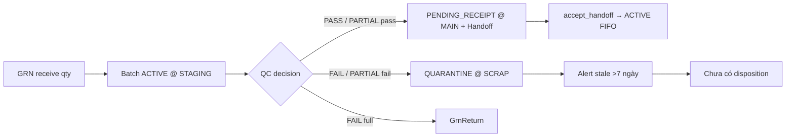

# Review module QC — hiện trạng, khoảng trống, đề xuất tối ưu

> Bản review chi tiết module QC hiện tại (đã đủ 6 FR Phase 2), đối chiếu thực tiễn WMS/ERP lớn, và lộ trình bổ sung nghiệp vụ theo thứ tự ưu tiên cho solo-dev — khuyến nghị Wave 1 là Quarantine Disposition.

## Todos theo dõi

- [x] Wave 1 — FSD + triển khai Quarantine Disposition (**3** action: `SCRAP_WRITEOFF` / `RETURN_SUPPLIER` / `RELEASE_TO_MAIN`; **không** gồm `REWORK`)
- [x] Wave 2 — Spec criteria gate nhẹ (bắt buộc criteria + cảnh báo mismatch + prefill theo category) — FSD xong, **triển khai chưa làm**, xem [`docs/qc/03_criteria_gate_fsd.md`](docs/qc/03_criteria_gate_fsd.md)
- [ ] Wave 3 — Đồng bộ BACKLOG/docstring/test names + `qc_no` IntegrityError retry
- [ ] Wave 4 — Chỉ khi cần: `Supplier`/`Product.qc_required` + audit skip QC
- [ ] Wave 5 — KPI QC theo NCC/SKU + email FAIL (sau reports/Celery)

---

## 0. Đối chiếu phản biện Claude (2026-08-04) — đã thống nhất

Claude Code đã fact-check `qc_plan.md` với code/BACKLOG/RBAC. Kết luận: **phần lớn plan đúng**; các điểm phản biện dưới đây đã được chốt vào bản này.

| # | Phản biện Claude | Quyết định chốt | Trạng thái |
|---|---|---|---|
| A | Gate quyền: approve/override vs `can_dispose_quarantine()` vs Approval 2 bước | **Phương án 1** — tái dùng `can('approve'/'override','qc')` | Đã ghi §P0 |
| B | `inventory` không có CRUD trong RBAC → nên hàm gate riêng (như handoff) | Không — disposition là **hậu quả QC**, gắn module `qc`; UI trên `batch_detail` chỉ thêm `can_view_menu('inventory')` | Đã chốt |
| C | `RELEASE_TO_MAIN` nên `is_department_manager(WAREHOUSE/QC)` hoặc Approval | Không — dùng `can('override','qc')` (Manager/Admin role), cùng separation-of-duties với `qc_override`; lý do bắt buộc + AuditLog | Đã chốt |
| D | `qc_partial_pass` **không** tạo `GrnReturn`; `GrnReturn` chỉ FK `grn`, không gắn batch/qty | Wave 1 `RETURN_SUPPLIER` **phải mở rộng** `GrnReturn`: thêm `batch` FK + `qty` — không tái dùng nguyên trạng | Bổ sung §P0 |
| E | Alert quarantine >7 ngày đã có (BACKLOG `[x]`) | Plan không phủ nhận — gap chỉ là **disposition thao tác** (BACKLOG `[ ]` dòng 231) | OK, không đổi |
| F | Wave ghi “4 action” nhưng `REWORK` để phase sau | Wave 1 = **đúng 3 action**; `REWORK` ngoài phạm vi | Sửa dưới đây |
| G | Docstring `GrnReturn` “KHÔNG đụng Inventory” lệch code | Wave 3 / cùng Wave 1 doc sync | Giữ P3 |
| H | Chưa có `docs/qc/` — nên theo precedent `docs/pur/` | Wave 1 FSD viết tại `docs/qc/01_quarantine_disposition_fsd.md` | Chốt đường dẫn |

**Không còn mâu thuẫn mở** giữa phản biện Claude và plan sau khi áp các quyết định trên.

---

## Kết luận ngắn

Module QC **đã đủ và vững** cho inbound inspection theo BRD/BACKLOG (6/6 FR-QC). Luồng lõi GRN → STAGING → PASS/FAIL/PARTIAL → MAIN handoff / SCRAP là đúng chuẩn WMS. Khoảng trống lớn nhất so với hệ thống chuyên nghiệp **không nằm ở “thiếu PASS/FAIL”**, mà ở **hậu xử lý hàng fail (disposition)**, **đóng vòng sampling ↔ criteria**, và **QC theo rủi ro NCC** — đúng với mục BACKLOG còn mở và pattern Infor/SAP/Oracle/D365.

---

## 1. Hiện trạng đã làm tốt (giữ nguyên)



| Khía cạnh | Đánh giá |
|---|---|
| Staging bắt buộc trước QC | Đúng chuẩn Oracle/SAP (QC location trước putaway) |
| PASS → `PENDING_RECEIPT` + handoff | Tốt hơn spec cũ; tách “QC đạt” khỏi “kho nhận FIFO” |
| FAIL → SCRAP thật + `GrnReturn` | Đúng; hàng fail có tồn vật lý |
| Lock order Grn→Qc→Inv→Batch→Handoff | Đã harden (BUG-18) |
| Override annotation-only | Đúng ranh giới đã chốt |
| Sampling gợi ý + SLA on-the-fly + ảnh evidence | Đủ Phase 2; phù hợp solo (⏸️ không Celery) |
| Criteria master + snapshot trên item | Đúng pattern lịch sử không vỡ khi master đổi |

**File lõi:** [`quality/services.py`](quality/services.py), [`quality/models.py`](quality/models.py), tích hợp [`receiving/`](receiving/), [`inventory/services.py`](inventory/services.py) (`move_batch_qty` / handoff).

### Chi tiết hiện trạng kỹ thuật (tóm tắt từ codebase)

#### Models (`quality/models.py`)
- `QcCriteria` — master data tiêu chuẩn QC (category/name unique, pass_rule/fail_rule, ảnh mẫu)
- `QcInspection` — status: `PENDING_QC` / `PASS` / `FAIL` / `PARTIAL_PASS` / `CANCELLED`; FK GRN; override annotation-only
- `QcInspectionItem` — snapshot criteria + PASS/FAIL từng dòng + ảnh evidence

#### Services (`quality/services.py`)
- `start_qc` — Batch ACTIVE @ STAGING + Inventory RECEIPT + GRN `QC_IN_PROGRESS`
- `qc_pass` — move → MAIN `PENDING_RECEIPT` + handoff
- `qc_fail` — move → SCRAP `QUARANTINE` + `GrnReturn`
- `qc_partial_pass` — split pass/fail
- `cancel_qc_inspection` — đảo staging khi hủy GRN mid-QC
- `suggested_sample_qty` / `overdue_inspections` — gợi ý & SLA (on-the-fly)

#### Workflow end-to-end
```
DRAFT → PENDING_APPROVAL → PENDING_QC → QC_IN_PROGRESS
  → PASS / FAIL / PARTIAL_PASS / override (annotation) / cancel
```

---

## 2. Khoảng trống nghiệp vụ (ưu tiên theo ROI solo-dev)

### P0 — Quarantine Disposition (đã ghi BACKLOG, chưa làm)

**Hiện tại:** FAIL/PARTIAL đưa hàng vào SCRAP + alert >7 ngày; **không có thao tác đóng vòng** (scrap hẳn / trả NCC / tái kiểm / phóng thích có điều kiện).

**Tham chiếu ngành:**
- **Infor LN**: disposition `Scrap` / `Return to Vendor` / `Rework` / `Use As Is` / `No Fault Found` → tạo adjustment / purchase return / production order
- **SAP EWM**: usage decision → follow-up logistical (putaway / scrap / transfer)
- App hiện có sẵn `GrnReturn` (FULL fail) và `reject_handoff(TO_SCRAP|BACK_TO_QC)` — nhưng **PARTIAL fail / lô kẹt SCRAP lâu** không có đường xử lý thống nhất

**Phạm vi Wave 1 — đúng 3 disposition (không gồm REWORK):**

| Disposition | Hành vi trong app |
|---|---|
| `SCRAP_WRITEOFF` | ADJUSTMENT âm Inventory SCRAP + Batch `CLOSED` + lý do bắt buộc + audit |
| `RETURN_SUPPLIER` | Mở rộng `GrnReturn`: thêm `batch` FK (nullable cho legacy) + `qty`; tạo return gắn đúng lô QUARANTINE (kể cả phần fail của PARTIAL — hiện `qc_partial_pass` **không** tạo return). Sau đó đi workflow `GrnReturn` sẵn có (PENDING→…→CLOSED); khi return COMPLETED/đóng phải trừ/đóng qty batch SCRAP tương ứng |
| `RELEASE_TO_MAIN` | Lý do bắt buộc — `move_batch_qty` SCRAP→MAIN `PENDING_RECEIPT` + `create_handoff` (Use-as-is có kiểm soát; FIFO chỉ sau `accept_handoff`) |
| `REWORK` | **Ngoài Wave 1** — BACKLOG vẫn ghi “rework” nhưng chưa triển khai; giữ QUARANTINE + xử lý thủ công cho tới wave riêng |

UI: nút trên [`batch_detail`](inventory/templates/inventory/) khi `status=QUARANTINE` (hiện chỉ có banner stale + không có action — `transfer` đã loại QUARANTINE).

#### Gate quyền disposition — **đã chốt Phương án 1** (sau phản biện Claude)

Tái dùng RBAC `qc` sẵn có (`approve` / `override`), không tạo permission mới, không Approval 2 bước, không `can_dispose_quarantine()`:

| Action | Gate | Ai được |
|---|---|---|
| `SCRAP_WRITEOFF` | `user.can('approve', 'qc')` | QC Inspector, Manager, Admin (cùng mặt phẳng với `qc_fail`) |
| `RETURN_SUPPLIER` | `user.can('approve', 'qc')` | Như trên |
| `RELEASE_TO_MAIN` | `user.can('override', 'qc')` | Chỉ Manager/Admin role — đảo quyết định QC fail → MAIN; **không** dùng `is_department_manager` riêng |

**Lý do không chọn PA 2/3 (Claude đã nêu, đã từ chối có chủ đích):**
- PA 2 (`can_dispose_*` trong `inventory`): disposition là hệ quả quyết định QC, không phải transfer kho thuần — gắn `user.can(..., 'qc')` nhất quán với `qc_result`/`qc_override`
- PA 3 (Approval 2 bước cho RELEASE): `override` + lý do + AuditLog đủ cho solo; tránh nhân đôi primitive khi chưa có nhu cầu vận hành

View/template: check đúng action theo disposition + `can_view_menu('inventory')` (UI trên `batch_detail`). Service layer re-validate status=`QUARANTINE`, warehouse SCRAP, qty, quyền (không tin form).

**Lock order:** tuân `Inventory → Batch → WarehouseHandoff` (và `Grn` nếu đụng `GrnReturn`/GRN status).

Đây là **gap nghiệp vụ lớn nhất** — tồn SCRAP chưa có đường đóng vòng có kiểm soát.

---

### P1 — Đóng vòng Criteria ↔ Quyết định QC (Wave 2)

**Hiện tại:** `QcInspectionItem` ghi PASS/FAIL từng tiêu chuẩn; **không gate** quyết định tổng. Sampling chỉ gợi ý.

**Thực tiễn:** FLEX inbound checklist, Hopstack, QSC — checklist có cấu trúc; kết quả criteria là bằng chứng kiểm toán, không nhất thiết auto-fail lot (đúng với lựa chọn hiện tại).

#### Vị trí gate ≥1 dòng criteria — **đã chốt Phương án 1**

`qc_pass` / `qc_fail` / `qc_partial_pass` **raise `ValidationError`** nếu inspection chưa có dòng `QcInspectionItem` nào. View/form chỉ disable nút Pass/Fail/Partial cho UX — **không** là lớp bảo vệ duy nhất.

**Lý do:** khớp convention CLAUDE.md *"form filter, service phải re-validate độc lập"* — chặn bypass qua script/shell/`manage.py`/test gọi thẳng service. Không chọn “chỉ chặn ở view/form”.

**Phạm vi tối thiểu Wave 2 (đã chốt đủ 3, xem FSD chi tiết):**
1. Gate service ≥1 criteria (đã chốt vị trí ở trên)
2. Cảnh báo (không chặn) nếu criteria FAIL nhưng chọn PASS overall — hoặc ngược lại. **Đã chốt**: banner
   nhỏ ngay trên trang `qc_result`, cạnh từng nút quyết định liên quan, tính từ dòng `QcInspectionItem`
   đã lưu — không chặn submit, không thêm state/double-confirm
3. Prefill criteria theo `Product.category` từ `QcCriteria` active. **Đã chốt**: tái dùng pattern JS
   `data-category` đã có ở `purchasing/forms.py` (`ProductSelectWithCategory`) — gợi ý qua `<datalist>`,
   tự điền `expected_value` chỉ khi đang trống, không đổi `criteria_name`/`expected_value` thành FK

Tránh AQL/ANSI Z1.4 full — quá nặng cho solo và ngoài 60-FR.

FSD đầy đủ: [`docs/qc/03_criteria_gate_fsd.md`](docs/qc/03_criteria_gate_fsd.md).

---

### P2 — Risk-based / skip-lot theo NCC (tối ưu lưu lượng, không bắt buộc Phase 2)

**Thực tiễn:** Oracle Vendor QC flag; SAP Dynamic Modification (Normal/Tightened/Reduced/Skip); D365 skip-lot; Hopstack risk-based.

**Hiện tại:** mọi GRN nhận qty đều `start_qc` → 100% lot vào STAGING.

**Đề xuất từng bước (YAGNI — chỉ khi kho bị nghẽn QC):**
1. `Supplier.qc_required` hoặc `Product.qc_required` (bool) — false → đường tắt: receive thẳng MAIN `PENDING_RECEIPT` + handoff, **không** tạo `QcInspection` (giữ audit “skipped QC”)
2. Sau đó mới scorecard đơn giản: đếm FAIL 90 ngày → escalate “luôn QC”
3. Skip-lot (1/N) và AQL — **hoãn** đến khi có số liệu vận hành thật

Lưu ý: đường tắt phải vẫn tôn trọng “MAIN only + handoff”; không cho vào FIFO khi chưa accept handoff.

---

### P3 — Làm sạch ranh giới & tài liệu lệch code

| Vấn đề | Việc cần làm |
|---|---|
| BACKLOG §2c vẫn viết PASS → Batch `ACTIVE` | Sửa thành `PENDING_RECEIPT` + handoff |
| Docstring `GrnReturn` “không đụng Inventory” | Cập nhật (FAIL đã credit SCRAP) |
| Tên test FAIL/PASS còn wording cũ | Rename cho khớp hành vi thật |
| `QcInspection.save` không retry `qc_no` collision | Align pattern GRN/PO (5× IntegrityError) |
| `reject_handoff(BACK_TO_QC)` chỉ annotation | Document rõ SOP thủ công (transfer / disposition) — hoặc Wave sau: tạo “re-inspect” ticket |

---

### P4 — Báo cáo / vòng kín với Purchasing (nice-to-have)

- KPI: % PASS / FAIL / PARTIAL theo NCC / SKU / tháng (feed `reports`)
- Email NCC khi FAIL (⏸️ đã hoãn — giữ notify in-app)
- Link scorecard NCC trên `supplier_detail`

Không chặn vận hành hàng ngày; làm sau disposition.

---

## 3. So sánh nhanh với app mẫu

| Năng lực | Oracle WMS | SAP EWM | Infor LN | **NVL hiện tại** |
|---|---|---|---|---|
| QC location / staging | Có | Có | Có | Có |
| Sampling %/fixed | Vendor rules | Sample procedure | Inspection | Gợi ý per SKU |
| Skip-lot / dynamic | Vendor flag | DMR | — | Chưa |
| Usage decision → logistics | Approve/Reject LPN | Decision codes | Disposition matrix | PASS/FAIL/PARTIAL + return |
| Quarantine disposition | Reject path | Follow-up | Scrap/RTV/Rework/Use-as-is | **Alert only — gap** |
| Evidence ảnh | RF workflows | Findings | NCMR | Có |
| Override / supervisor | Có | Có | Có | Annotation-only (đã chốt) |

**Nguồn tham chiếu chính:**
- Oracle WMS Cloud — System-Directed Quality Control / Vendor QC
- SAP EWM — Quality Inspection Engine, Dynamic Modification Rule
- Infor LN — Quarantine Inventory Disposition (Scrap / RTV / Rework / Use As Is)
- Dynamics 365 — Flexible sampling / skip-lot
- Hopstack / FLEX — risk-based inbound QC checklist

**Kết luận đối chiếu:** app đã có “xương sống” đúng; thiếu chủ yếu **disposition sau quarantine** và **động cơ rủi ro** — không thiếu model PASS/FAIL cơ bản.

---

## 4. Lộ trình khuyến nghị (đã chọn hướng)

Không triển khai “QC enterprise full”. Thứ tự:

1. **Wave 1 — Quarantine Disposition** (P0): **3** action + mở rộng `GrnReturn(batch, qty)` + tests + tick BACKLOG dòng disposition
2. **Wave 2 — Criteria gate nhẹ** (P1): bắt buộc ghi criteria + warn mismatch + prefill theo category
3. **Wave 3 — Doc sync + `qc_no` retry** (P3): sửa docstring `GrnReturn`, BACKLOG §2c `ACTIVE`→`PENDING_RECEIPT`, rename test wording, retry `qc_no`
4. **Wave 4 — QC optional / risk flag** (P2): chỉ khi vận hành thật bị nghẽn
5. **Wave 5 — QC analytics + email** (P4): gắn Phase reports / Celery tốt nghiệp

---

## 5. Việc tiếp theo (Wave 1) — sẵn sàng viết FSD

Sau khi Ryan xác nhận bản thống nhất này:

1. Viết FSD: [`docs/qc/01_quarantine_disposition_fsd.md`](docs/qc/01_quarantine_disposition_fsd.md) (tạo thư mục `docs/qc/`, theo precedent `docs/pur/`)
2. Viết implementation plan ngắn + TDD trên `inventory` / `receiving` / `quality`
3. Triển khai Wave 1 only — **chưa** Wave 2–5

**Phạm vi FSD Wave 1 phải cover:**
- 3 disposition + gate quyền PA1
- Mở rộng `GrnReturn` (`batch`, `qty`) + hành vi khi PARTIAL fail
- UI `batch_detail` + form lý do
- Lock order, audit, AC/TC IDs (`TC-QC-DISP-*`)
- Ngoài phạm vi: REWORK, skip-lot, criteria gate, email NCC
